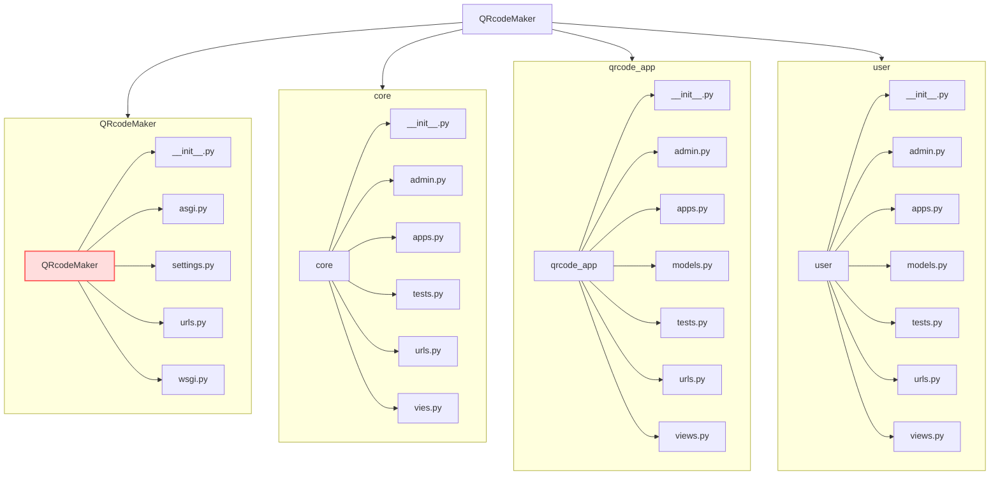

# QRcodeMaker
## Навігація:
- [Мета проекту](#-мета-проекту)
- [Команда](#-команда)
- [Технології](#-технології)
- [Структура](#-структура)
- [Додатки](#-додатки)
- [Як встановити та запустити проект?](#-як-встановити-та-запустити-проект?)
## Мета проекту:
Мета проекту - розробити сайт для створення qr кодів, на сайті присутня система акаунтів та підписок, та після закінчення часу підписки певні qr коди стають недоступними. Проект застосовує технології які можуть використовуватися у інших, більш великих проектах.
## Команда:
- [Moskowsky Artem - TeamLid](https://github.com/artemijMoskowsky)
- [Naumenko Nikita](https://github.com/Naumenko0Nikita)
- [Ovcharenko Julia](https://github.com/JuliaOvcharenko)
- [Sivaiev Matvii](https://github.com/MatviiSivaiev2009)

## Технології:
- Основний фреймворк - Django
- Мова програмування - Python

## Дизайн:
[Figma design](https://www.figma.com/design/THXxokVBx5AabxUlqFFraT/Django_practice?node-id=0-1&p=f&t=w1Ao5QVqjaxjg4ok-0)
[FigJam](https://www.figma.com/board/44X5cJmHaPuCq5iWyWdi6a/QRcodeMaker?node-id=0-1&p=f&t=vLgKSBsDpEbf0fH3-0)
## Структура:


## Додатки:
### core
У цьому додатку знаходятся домашня сторінка, та сторінка контактів. На домашній сторінці відбуваєтся зміна підписки. На сторінці контактів відбуваєтся відправка feedback.
[Подивитись структуру та логіку додатку](QRcodeMaker/core/views.py)
### qrcode_app
У цьому додатку відбуваєтся створення, видалення, та відображення qr кодів.
[Подивитись структуру та логіку додатку](QRcodeMaker/qrcode_app/views.py)
### user
У цьому додатку відбуваєтся реєстрація та авторизація користувача.
[Подивитись структуру та логіку додатку](QRcodeMaker/user/views.py)

## Як встановити та запустити проект?
### Встановлення:
Завантажте проект
```bash
  git clone https://github.com/artemijMoskowsky/QRcodeMaker
```
Перейдіть до папки з проектом
```bash
  cd QRcodeMaker
```
Завантажте залежності
```bash
  pip install -r requirements.txt
```

### Запуск:
Перейдіть до головної папки сайту
```bash
  cd QRcodeMaker
```
Запустіть скрипт через manage.py
```bash
  python manage.py runserver [порт, але це не обов'язково]
```

## Висновок
Проект корисний тим що тут описана основа Django, ORM, та структура складних проектів. Для цього проекту ще є місце для росту, наприклад можна переписати наші старі варіанти вирішення проблем на нові, можна буде додати нові можливості підписок та акаунтів, або взагалі розбити проект на мікросервіси. Але вже у такому вигляді проект дав нам багато знань та практики.
